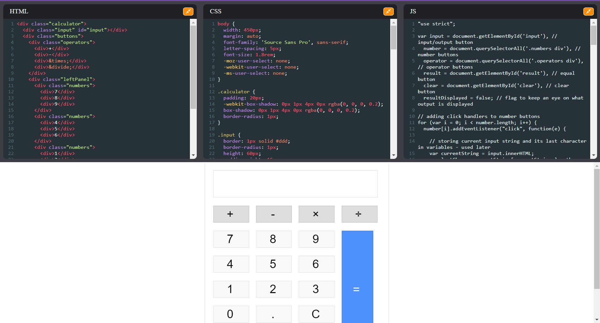

# Codepen Clone
   
**CodePen** is an online platform for testing and showcasing user-created HTML, CSS and JavaScript code snippets. It functions as an online code editor and open-source learning environment, where developers can create code snippets, called "pens," and test them.

### Built With
* [React JS](https://reactjs.org)

### Demo

[Click Here](https://abatra-codepen-clone.netlify.app/)

## UI 

### Built By Abhishek Batra
